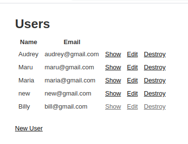
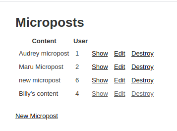

<!--
*** Thanks for checking out this README Template. If you have a suggestion that would
*** make this better, please fork the repo and create a pull request or simply open
*** an issue with the tag "enhancement".
*** Thanks again! Now go create something AMAZING! :D
-->

<!-- PROJECT SHIELDS -->
<!--
*** I'm using markdown "reference style" links for readability.
*** Reference links are enclosed in brackets [ ] instead of parentheses ( ).
*** See the bottom of this document for the declaration of the reference variables
*** for contributors-url, forks-url, etc. This is an optional, concise syntax you may use.
*** https://www.markdownguide.org/basic-syntax/#reference-style-links
-->
[![Contributors][contributors-shield]][contributors-url]
[![Forks][forks-shield]][forks-url]
[![Stargazers][stars-shield]][stars-url]
[![Issues][issues-shield]][issues-url]

<!-- PROJECT LOGO -->
 

  

  <h3 align="center">Toy App</h3>

  

    This project is part of the Microverse Ruby on Rails curriculum!
     
    <a href="https://github.com/rammazzoti2000/toy_app"><strong>Explore the docs »</strong></a>
     
     
    ·
    <a href="https://github.com/rammazzoti2000/toy_app/issues">Report Bug</a>
    ·
    <a href="https://github.com/rammazzoti2000/toy_app/issues">Request Feature</a>
  

<!-- TABLE OF CONTENTS -->
## Table of Contents

* [About the Project](#about-the-project)
  * [Built With](#built-with)
  * [Usage](#usage)
  * [Live Demo](#live-demo)
  * [Automated Test](#automated-test)
* [Author](#author)
* [Contributing](#contributing)
* [Acknowledgements](#acknowledgements)

<!-- ABOUT THE PROJECT -->
## About The Project

![Product Name Screen Shot][product-screenshot]

This is the first Microverse project of the Ruby on Rails Curriculum

This is also part of the Odin project curriculum https://www.theodinproject.com/courses/ruby-on-rails/lessons/getting-your-feet-wet

And the second chapter of the Learn enough to be dangerous tutorial https://www.learnenough.com/ruby-on-rails-4th-edition-tutorial/toy_app#sec-planning_the_application

### Built With
This project was built using these technologies.
* Ruby 2.5.7
* Rails 6.0.1
* Windows 10
* Manjaro Linux
* Stickler
* Atom :atom:
* RubyMine

<!-- ABOUT THE PROJECT -->
### Usage

If you want to test it you need to have Ruby and Rails installed in your computer and [download](https://github.com/rammazzoti2000/toy_app/archive/master.zip) or clone this repo as follows:
* `$ git clone https://github.com/rammazzoti2000/toy_app.git"`

after that you need to open a terminal inside the repo and run the bundler
* `$ bundle  install --without production`

then, run rails db:migrate. This creates the database with the corresponding tables, columns and associations.
* `$ rails db:migrate`

and finally, you can test it in the console using the sandbox with the following command
* `$ rails server`

If no errors were displayed open a browser in your [localhost](http://localhost:3000/) and you should be able create new users, edit and destroy them 

If you want to create new microposts, edit or destoy them you have to go to the [microposts](http://localhost:3000/microposts) page

<!-- AUTOMATED TEST -->
### Automated Test

> There are no Automated Test for this project yet

<!-- CONTACT -->
## Contributors

👤 **Roman Nikolaev** 
    
- LinkedIn: [Roman Nikolaev](https://www.linkedin.com/in/roman-nikolaev-65b639197/) - 
- GitHub: [@vzdrizhni](https://github.com/vzdrizhni)
- E-mail: vzdrizhni@gmail.com

👤 **Alexandru Bangau**

- LinkedIn: [Alexandru Bangau](https://www.linkedin.com/in/alexandru-bangau/)
- GitHub: [@rammazzoti2000](https://github.com/rammazzoti2000)
- E-mail: bangau.alexandru@gmail.com

## :handshake: Contributing

Contributions, issues and feature requests are welcome!

Feel free to check the [issues page](https://github.com/rammazzoti2000/toy_app/issues/).

## Show your support

Give a :star: if you like this project!

<!-- ACKNOWLEDGEMENTS -->
## Acknowledgements
* [Microverse](https://www.microverse.org/)
* [The Odin Project](https://www.theodinproject.com/)
* [Learn enough to be dangerous Ruby on Rails Tutorial](https://www.learnenough.com/ruby-on-rails-4th-edition-tutorial/)

<!-- MARKDOWN LINKS & IMAGES -->
<!-- https://www.markdownguide.org/basic-syntax/#reference-style-links -->
[contributors-shield]: https://img.shields.io/github/contributors/rammazzoti2000/toy_app.svg?style=flat-square
[contributors-url]: https://github.com/rammazzoti2000/toy_app/graphs/contributors
[forks-shield]: https://img.shields.io/github/forks/rammazzoti2000/toy_app.svg?style=flat-square
[forks-url]: https://github.com/rammazzoti2000/toy_app/network/members
[stars-shield]: https://img.shields.io/github/stars/rammazzoti2000/toy_app.svg?style=flat-square
[stars-url]: https://github.com/rammazzoti2000/toy_app/stargazers
[issues-shield]: https://img.shields.io/github/issues/rammazzoti2000/toy_app.svg?style=flat-square
[issues-url]: https://github.com/rammazzoti2000/toy_app/issues
[product-screenshot]: app/assets/images/screenshot.PNG
